# Image-processing

This repo contains all my learnings in Open-CV 

## Basics
### Image-openning
The source code is <a href="https://github.com/Blackcipher101/Image-processing/blob/master/Image-open.py">here</a>

Opencv has function ```cv2.imread(str,channel)``` it takes the arguments of string(filename or path) and the channel 0 corresponds to B/W and 1 corresponds to Color.
It can open BMP, JPEG, PNG, PPM, RAS file formats and convert them to ```cv2.Mat``` which is basically a matrix like
#### B/W
[ [2 3 4 5 6 7 8]<br>
 [2 3 4 5 1 8 4]<br>
 [6 7 8 9 3 4 5] ]<br>
#### Color
[ [[100 34 25] [100 34 25] [100 34 25] [100 34 25]
 [100 34 25] [100 34 25] [100 34 25][100 34 25]
 [100 34 25] [100 34 25] [100 34 25] [100 34 25]]

```cv2.imshow((str),matrix)```  which can open the martrix to image the string is the name of the window 
if the image is to large one can use ```cv2.namedWindow('image', cv.WINDOW_NORMAL)``` it allows you to resize the window

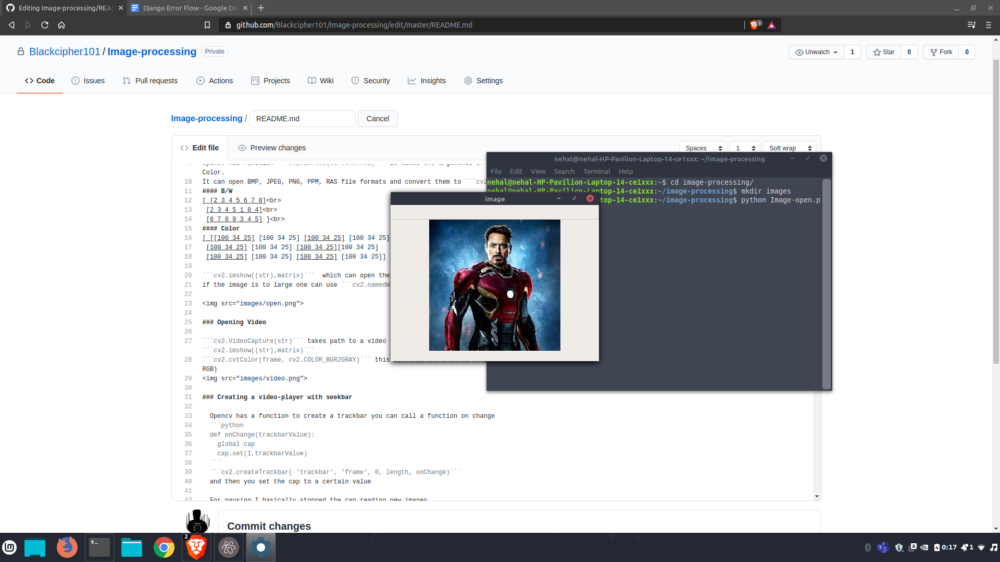

### Opening Video

```cv2.VideoCapture(str)``` takes path to a video file or 0 for webcam it returns a stream image which can then be read into matrix and displayed using ```cv2.imshow((str),matrix)```
```cv2.cvtColor(frame, cv2.COLOR_BGR2GRAY)``` this converts the channel to B/W (don't get scared newbies what is channel its basically way you define color like RGB) 
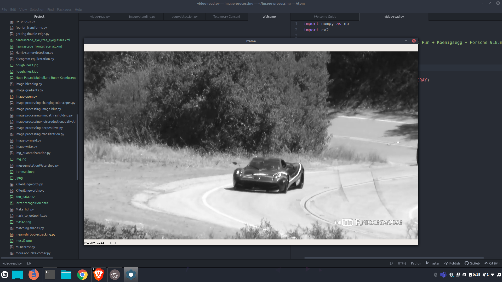

### Creating a video-player with seekbar

  Opencv has a function to create a trackbar you can call a function on change
  ```python
  def onChange(trackbarValue):
    global cap
    cap.set(1,trackbarValue)
  ```
  ```cv2.createTrackbar( 'trackbar', 'frame', 0, length, onChange)```
  and then you set the cap to a certain value
  
  For pausing I basically stopped the cap reading new images
  So s pause and r runs
  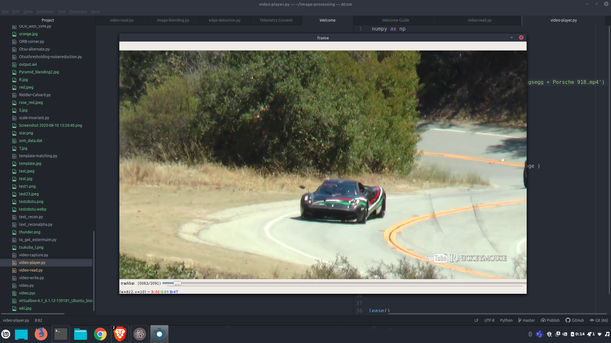
  
  ### Drawing
  In opencv we can use functions ```cv2.line()``` ```cv2.rectangle()``` ```cv2.circle()``` ```cv2.ellipise()``` ```cv2.polylines()``` 
  for more info on the functions go to <a src="https://opencv-python-tutroals.readthedocs.io/en/latest/py_tutorials/py_gui/py_drawing_functions/py_drawing_functions.html#drawing-functions">docs</a>
  
  ## Image processing
  
  ### Object-tracking(based on color)
  So we convert the image to HSV ```cv2.cvtColor(frame, cv2.COLOR_BGR2HSV)``` we changed to HSV because it gives us a range of colors with change of value.
  We make a image thresholding ```cv2.inRange(hsv, lower_blue, upper_blue)``` with a range and then we <strong>and with every pixel of both</strong> ```cv2.bitwise_and()``` it with the image so results in image only with the object
  
  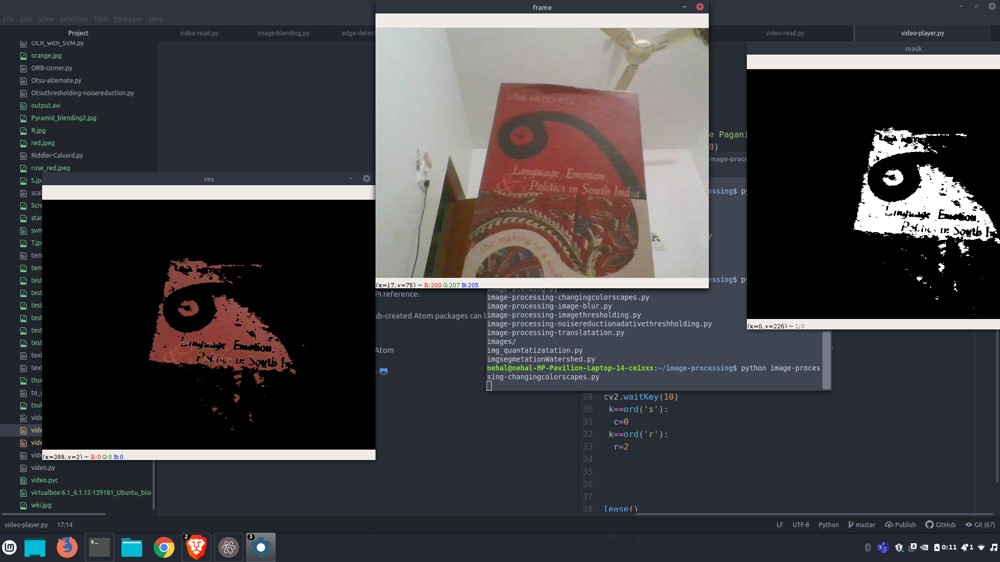
  
  ### Thresholding
  In Opencv we set a pixel value with respect to another pixel value like<br>
  if its less than a certain value it will be set to certain if not then to another
  ``` if x>125: then x=225 else x=0 ```
  
  There are various ones like THRESH_BINARY,THRESH_BINARY_INV,THRESH_TRUNC,THRESH_TOZERO,THRESH_TOZERO_INV
  
  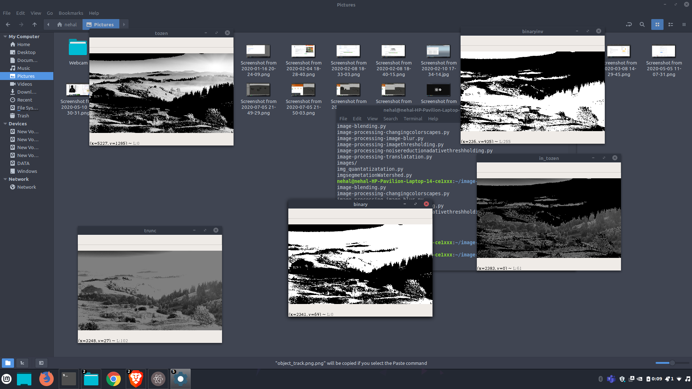
  
  #### Adaptive thresholding
  This is a method where we decide the max value based on region of image
  ```cv2.adaptiveThreshold(img,255,cv2.ADAPTIVE_THRESH_GAUSSIAN_C,\cv2.THRESH_BINARY,11,2)```
            
   But when we have bimodal images(images with two peaks in a histogram)
   We <strong>Otsu,Riddler-Cavldier and Killer IIingworth</strong>method.
   
    
   ### Image smoothing
   
  Image smoothing is just removal of the edges which results in a blurred image it is done by calling ```cv2.GassuianBlur()```. It allows to reduce the noise in the image 
  but we loose some infomartation in the process Gaussain Blur by taking an average of 5X5 matrix.
  
  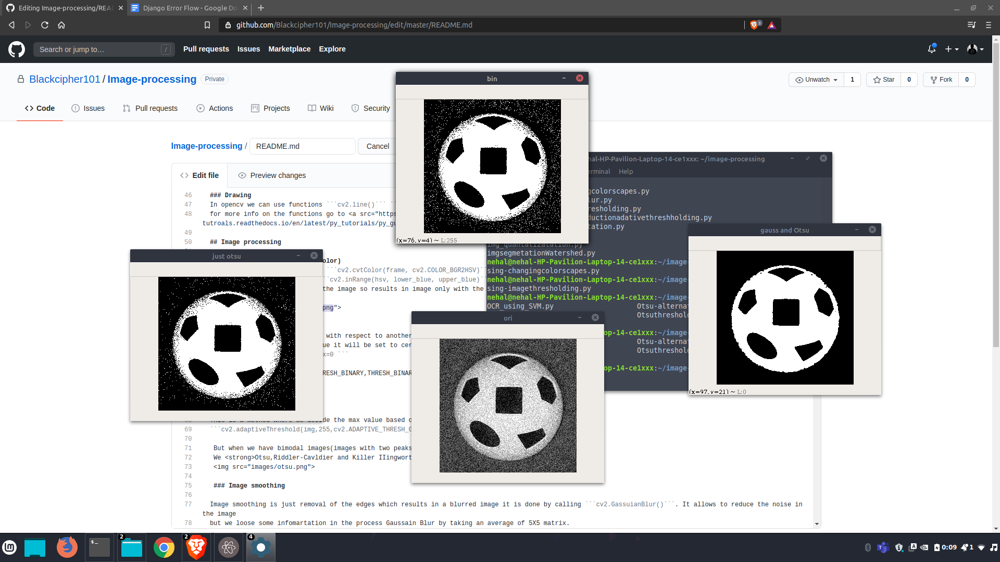
  
  ### Morphigical Transformatations
  Its a opertation on we do on binary to erode or diilate images 
  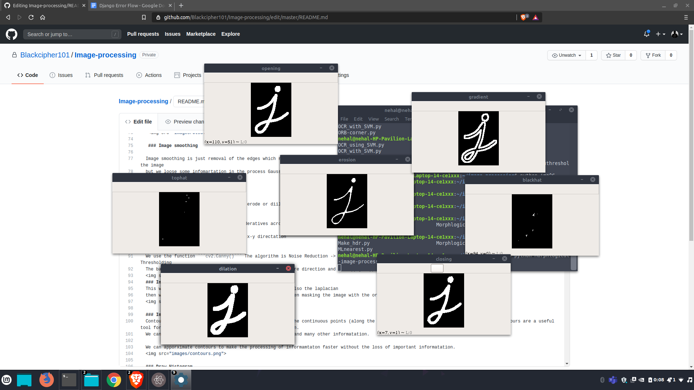
  ### Image gradients
  We use```cv2.sobel()``` to find image deratives across a direction it gives us the edges in one direction 
  We also get edges in both direction in x-y directation 
  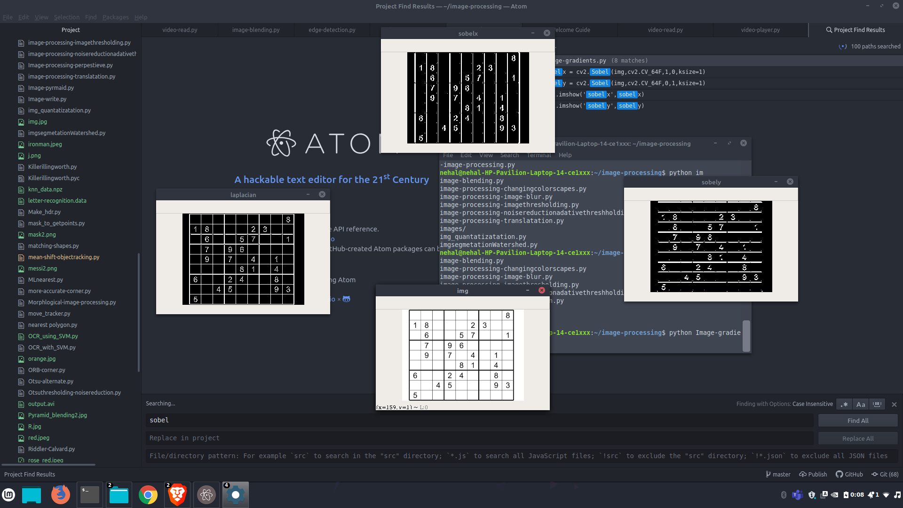
  ### Edge detection
  We use the function ```cv2.Canny()``` The algorithm is Noise Reduction -> Finding Intensity Gradient of the Image -> Non-maximum Suppression -> Hysteresis Thresholding
  The basic method is to apply image in gradient in 4 or more direction and the apply suppersion and then find the sure edges.
  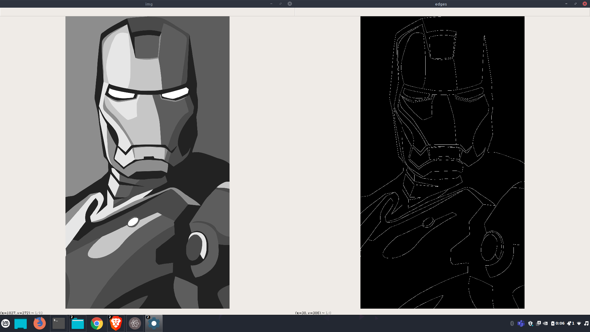
  ### Image Blending
  This we make images arrays by downscaling the image and also the laplacian 
  then we keep adding the half of both the laplacian and then masking the image with the orginal
  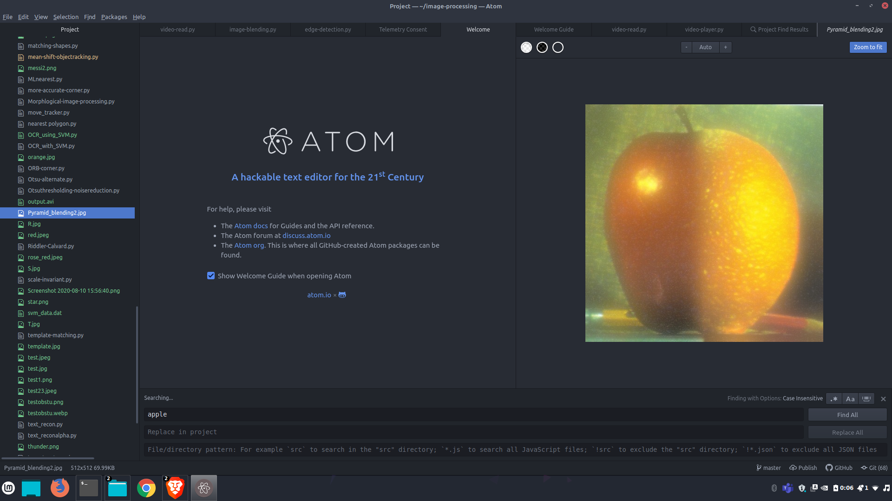
  
  ### Image contorors
  Contours can be explained simply as a curve joining all the continuous points (along the boundary), having same color or intensity. The contours are a useful tool for shape analysis and object detection and recognition.
  We can use these contours to find moments,area,perimeter and many other informatation.
  
  We can apporximate contours to make the processing of informamtaton faster without the loss of important informatation.
  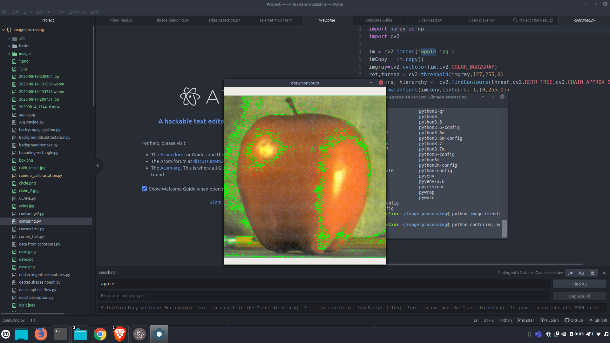
  
  ### Draw Histogram
  You can consider histogram as a graph or plot, which gives you an overall idea about the intensity distribution of an image. It is a plot with pixel values (ranging from 0 to 255, not always) in X-axis and corresponding number of pixels in the image on Y-axis.
  
  
  #### Enhanced image
  The image have a better as it improves the image by adding pixels whose frecquency is less.
  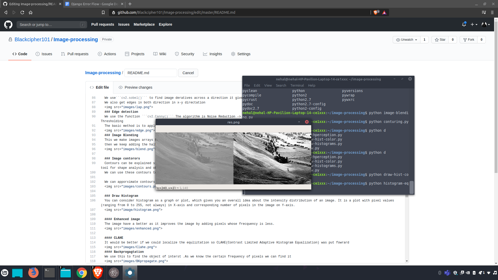
  
  #### CLAHE 
  It would be better if we could localize the equliztation so CLAHE(Contrast Limited Adaptive Histogram Equalization) was put fowrard 
  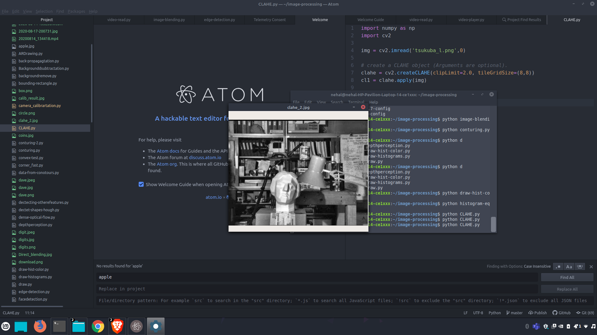
  #### Backprogagtation
  We use this to find the object of interst .As we know the certain frequency of pixels we can find it
  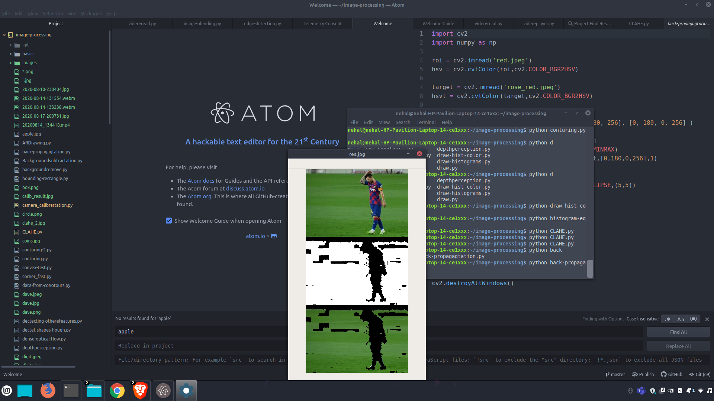
  
  
  ### Template matching 
  We can find certainpart of a image by matching the image to a current template
  They have various methods but most of the times cv2.TM_CCOEFF works best
  
  
  ### Image segmentation With watershed Algorithm
  We have to segment the images into its smallest constuient parts
  Algorithm
  Threshold->Morphlogical opertations->Transforms->Mask\
  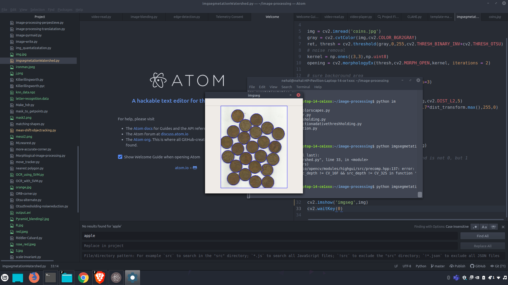
  ### Foregourd Subtractation
  We use the Grabcut algorithm to remove the backgroung image and also apply mask to improve the accuracy
  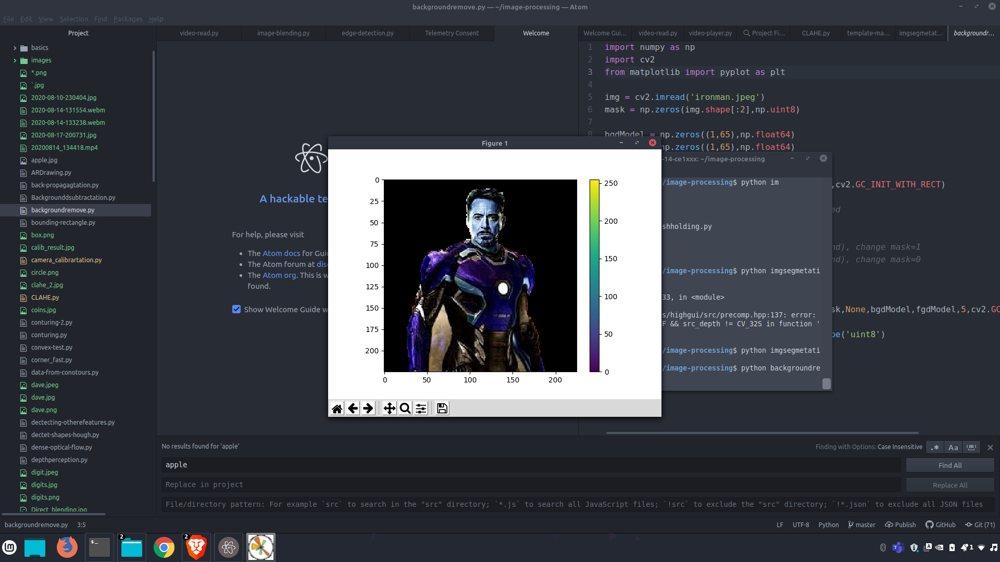
  
  ## Fearture detection
  We will be looking at many algorithms that detect corners
  
  ### Harris corner detection
   It basically finds the difference in intensity for a displacement of (u,v) in all directions.
   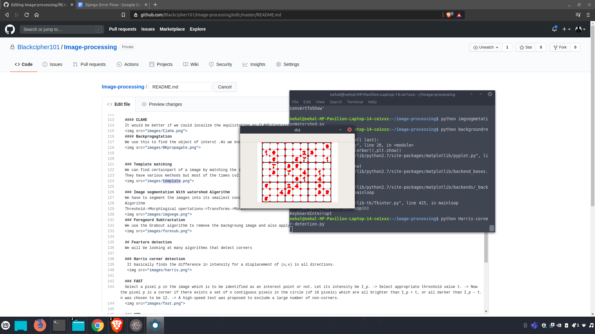
    
  ### FAST 
  Select a pixel p in the image which is to be identified as an interest point or not. Let its intensity be I_p. -> Select appropriate threshold value t. -> Now the pixel p is a corner if there exists a set of n contiguous pixels in the circle (of 16 pixels) which are all brighter than I_p + t, or all darker than I_p − t. n was chosen to be 12. -> A high-speed test was proposed to exclude a large number of non-corners.
  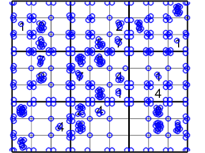
  
  ### ORB
  We have a perfect mixture and also the point its not patented
  
  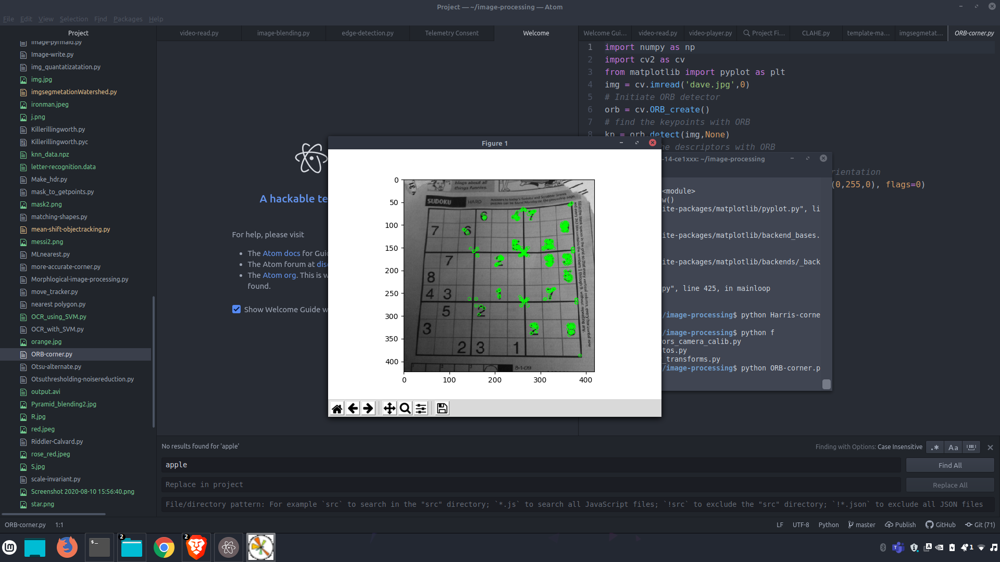
  ## Video analysis
  
  ### Mean shift(object tracking)
  The intuition behind the meanshift is simple. Consider you have a set of points. (It can be a pixel distribution like histogram backprojection). You are given a   small window ( may be a circle) and you have to move that window to the area of maximum pixel density (or maximum number of points).
  
  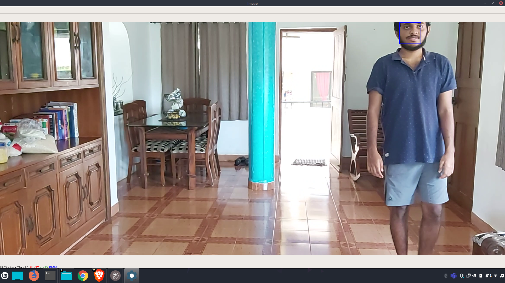
  
  ### Optical flow
  Optical flow is basically tracking the apparent motion on a object and its patterns to do it we use Lucas-Kanade method.We have seen an assumption before, that   all the neighbouring pixels will have similar motion. Lucas-Kanade method takes a 3x3 patch around the point. So all the 9 points have the same motion. We can     find (f_x, f_y, f_t) for these 9 points. So now our problem becomes solving 9 equations with two unknown variables which is over-determined. A better solution    is obtained with least square fit method. We can track features like corners but when we track a songle corner we can draw in air with our fingers :P
  
  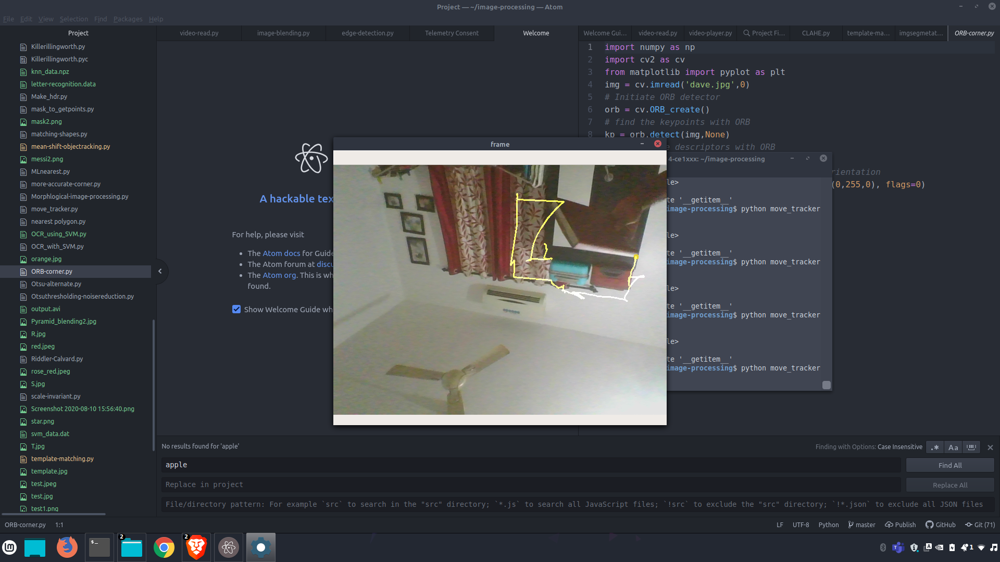
  ### Background subtracation
  We subtract the fore ground from the moving objects so we can track them. We can do this using three methods BackgroundSubtractorMOG,BackgroundSubtractorMOG2,BackgroundSubtractorGMG and BackgroundSubtractorGMG proves to be better as it is taken morphological image and reduced noise as a result.
  
  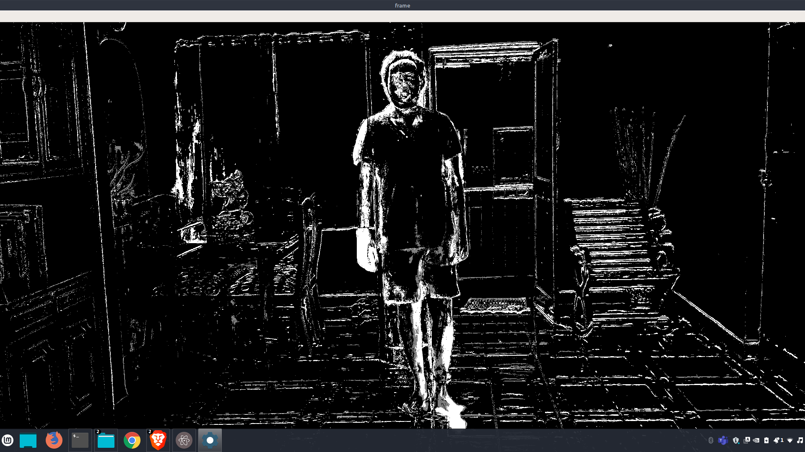
  
  ## Machine Learning
  
  ### K-Nearest Neighbor(kNN)
  This explains the basic idea of ML where find the most probable answer by measuring its varience from the nearest sure dataset.
  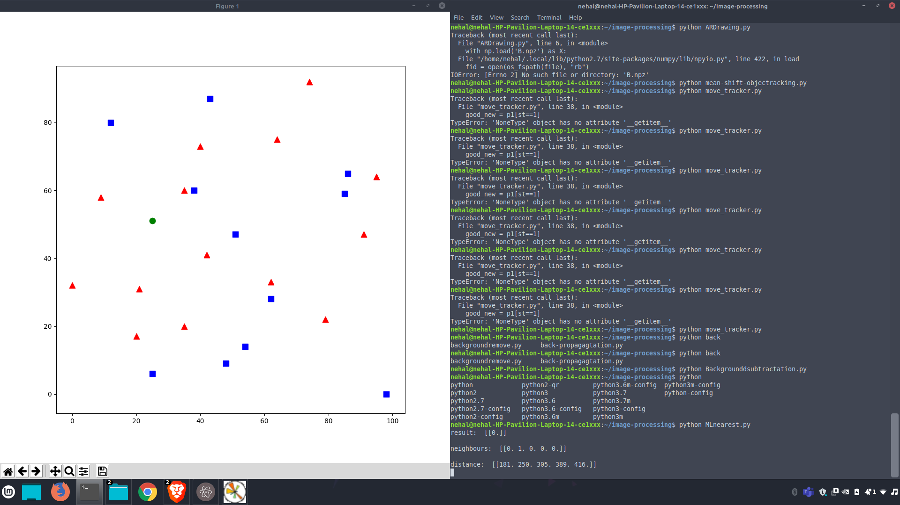
  
  ### OCR
  We uses kNN and pre given dataset to train and test the for testing digit detection for explantation it works <a href="https://www.youtube.com/watch?v=aircAruvnKk">here</a>
  
  ###  Quantizing Colors
  We can quantize colors if want to drop the computation but want to still carry forward the color data. We quantize the colors using kNN clustering.
  
  
  
  ### Face detection 
  
  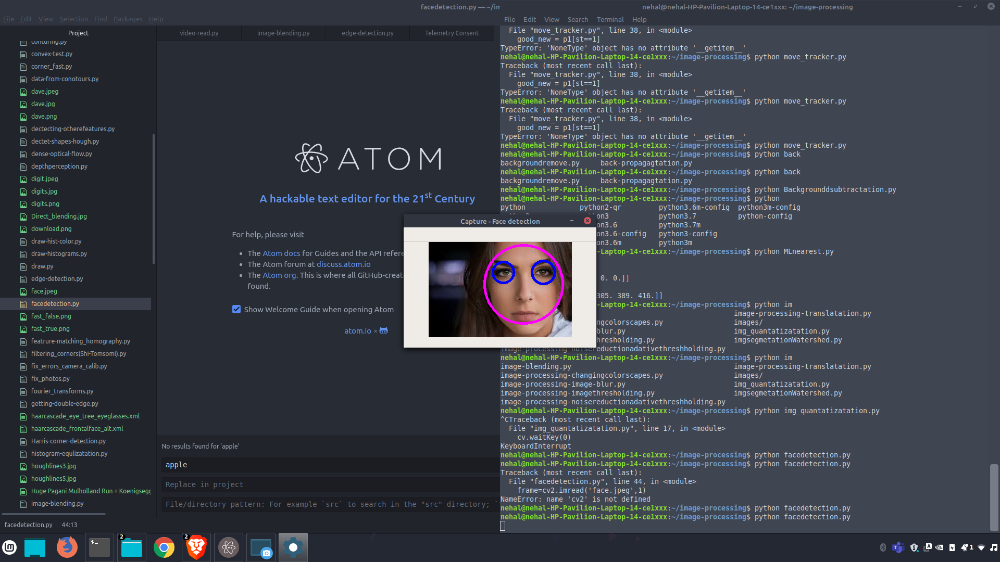
  
